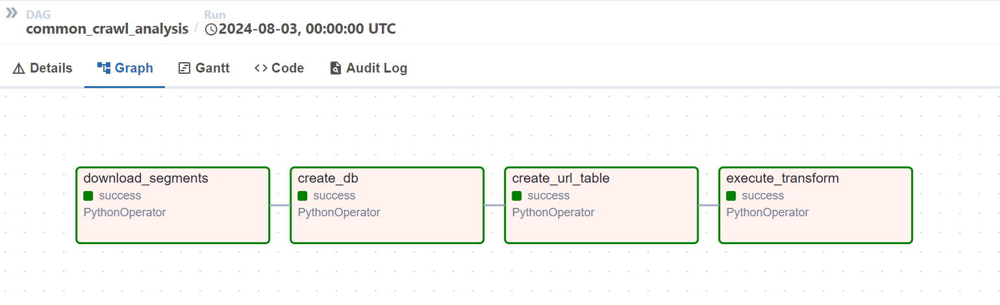

# Coding Challenge


The project is composed by the Latest Version of Airflow (2.9.3) with a PostgreDB where to store airflow metrics and to create the DB (common_crawler_db) to store URLs and a first aggregated result.

To run the project:
```bash
    docker-compose -f docker-compose.yml up --build
``` 

To access to airflow UI go at http://localhost:8080 and access with:
- user: admin
- password: admin

Here you will find the DAG "common_crawl_analysis". (Step 11 of Coding Challenge)

Then:
- Turn on the pipeline
- Trigger the dag. This is not scheduled and with no retries. Parameters can be put to schedule regulary the pipeline.


The Pipeline is composed of these steps:



1. **download_segments**: This step involves downloading three file segments within the last instance on the commoncrawl.org site. This step then saves the files locally, which are then read and processed to be inserted into PostgreSQL.
The common crawl archive used is CC-MAIN-2024-30. The files used are in ".wat" format. Wat files contain the metadata of the sites including the url.
2. **create_db**: This step performs a check whether the database has already been created (e.g. from a previous run) and if not, creates it.
3. **create_url_table**: it saves the data into one column table that's called "url_table" on PostgreSQL. (Step 3 of Coding Challenge)
4. **execute_transform**: this step transforms urls and saves the result back to PostgreSQL a table (Steps 5-6-7-8 of Coding Challenge exercise); that table will be used by a notebook to execute Steps 9-10.

The resulting dataframe is composed as follows:

| Column Name | Description                                                                         |
|-------------|-------------------------------------------------------------------------------------|
| homepage    | url of the homepage of the site                                                     |
| is_homepage | flag that indicates if the url is a homepage or not                                 |
| subsections | the subsections of the website navigated by the crawl. (this is a set of string)    |
| count       | how many times that homepage, with subsections or not, appears in the dataset       |
| country     | the country of the site                                                             |
| category    | the category of the site                                                            |
| is_ad_based | flag that, for uncategorized websites, indicates if they are ad-domain based or not |

------------------------------------------------------------------------------------------------------------------------------------------------------------------------

Considerations of steps 6-7-8 of the Coding Challenge.
- Step 6: **"Identify the country of the website"** Thanks to a search, I found several APIs that identify the country with the website or IP (i.e. geoip2). I haven't used that APIs, but I tried to identify the country by extracting the last part of the domain and filtering the strings that have a number of characters != 2. Obviously, this is not the best solution, but there are many unknown and suspicious urls in this dataframe and I preferred this choice to stay safe.
- Step 7-8: **"Categorize website - Ad-Domain based"** After a search, I found several services that provide website classification via API. All of them are not free and with very limited calls in the trial version.
I therefore decided to create a list of categories (the 1st level of Klazify categories) and to randomly distribute them across websites. In my list of categories I also added the value 'UNKOWN', to cover the case of not identified websites (klazify_categories.py)
For completeness, here is the code snippet in case you used the klazify api:


``` 
def get_category(url):
        api_key = 'API_KEYY'
        api_endpoint = 'https://www.klazify.com/api/categorize'
        
        try:
            response = requests.post(api_endpoint, 
                                     data={'url': url},
                                     headers={'Authorization': f'Bearer {api_key}'})
            
            if response.status_code == 200:
                category = response.json()['domain']['categories'][0]['name']
                return category
            else:
                return 'UNKOWN'
        except:
            return 'UNKOWN'
```
Following this, for the same reasons, I decided to apply the same procedure to identify the ad based domains (here I used a 50/50 random component with numpy).

------------------------------------------------------------------------------------------------------------------------------------------------------------------------

Step 9 - 10: To compute the 5 metrics I decided to use a Notebook, in order to perform data exploration and analysis. The last step in the Notebook is the saving of the result table in arrow format, partitioned by category (not saved on git - please run the cell in the notebook if you want the files). I have many unrecognised values by country but, with the libraries mentioned above, the value would drop dramatically:
Inside the notebook folder there is a notebook which allows the connection to the postgres db and retrieve the result table of the transformations.
The metrics I decided to implement are the following:

1. **Percentage of Categorised Websites**: This metric helps us understand the proportion of websites that have been successfully categorised. Useful to understand if the 'category' column is complete and stable enough to perform analysis.
2. **Assess how many un-categorised sites are actually ad-based**: This can help to evaluate if the algorithm is good or not. If there are many websites with category 'UNKNOWN' and not ad based, probably the categorization algorithm is not so good.
3. **Top 5 Categories by Count**: This shows us the most common categories in our dataset. This may be useful to analyse in detail the behaviour or content of the most informative category.
4. **Distribution of websites by country (mode)**. The most common category in each country. 
5. **Country with the highest number of sites and subdomains**. This gives us a high level idea on the different extensions/depth of the websites in the various country.

### Access To Postgres DB

If you want to access to the common_crawl_db you can use also a tool like dbeaver with this configuration:
- **host**: localhost
- **port**: 5434
- **user**: airflow
- **password**: airflow
- **DB name**: common_crawl_db

### Final Consideration

This exercise is based on just 3 segments, and for this reason using Pandas on an airflow worker node works well enough.
Instead, in a production environment, where the load has to be distributed, it's recommended to use a Spark Cluster (like EMR) to scrape and analyze the data in optimized way.